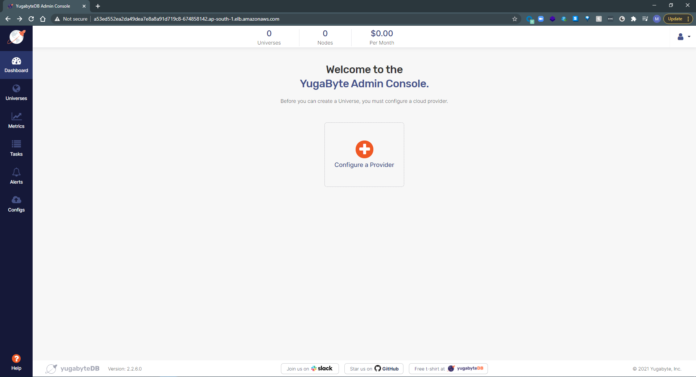
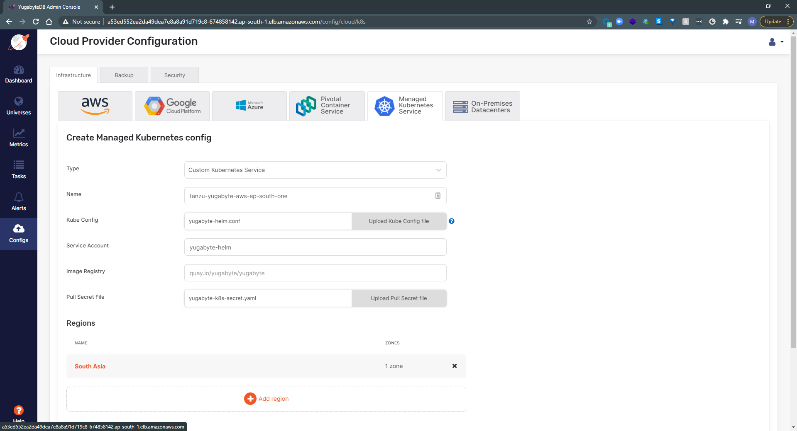
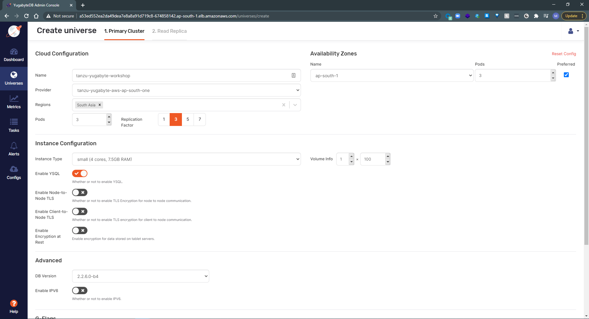
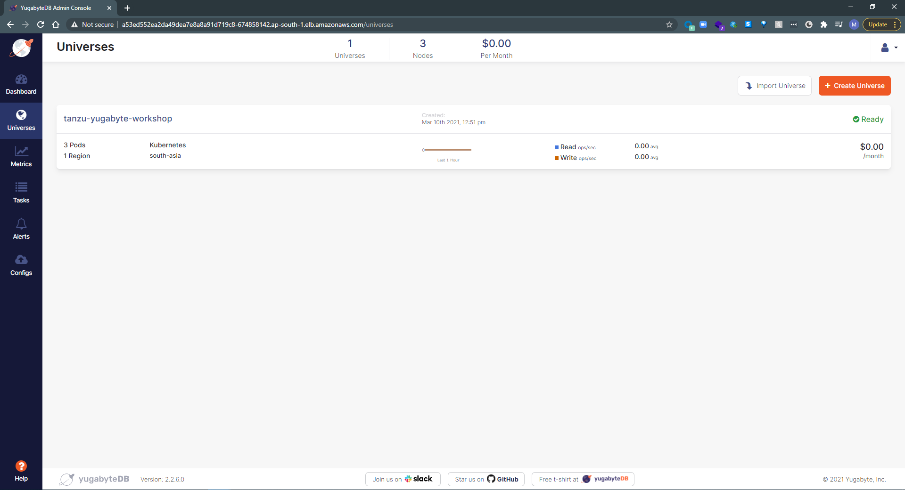
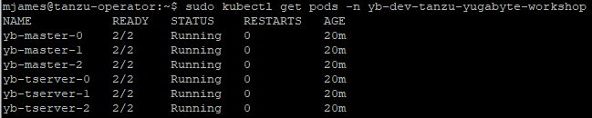

Tanzu/YugabyteDB Workshop
=============================

This repository will outline the steps necessary for building a demo or workshop showcasing integration of YugabyteDB with VMware Tanzu Build Service (TBS) and Tanzu Kubernetes Grid (TKG). These include the following...

* installing an instance of a YugabyteDB Universe to a TKG cluster.
* creating a sample database to which a Spring Boot application will connect.
* build a container image from a Spring Boot application with TBS hosted in a TKG cluster.
* deploy the image to a TKG cluster.
* setup users participating in a workshop setting (optional).
 
Here is a high-level reference architecture.

## Prerequisites

* The secret acquired by YugabyteDB for pulling the chart to install the YugabyteDB Platform version (UI-based).

* Access to a running [Tanzu Build Service](https://docs.pivotal.io/build-service/1-0/index.html) instance.

* Access to a running [Tanzu Kubernetes Grid](https://docs.vmware.com/en/VMware-Tanzu-Kubernetes-Grid/index.html) workload cluster.

* helm CLI.

* JRE (sudo apt install default-jre).

* NOTE: For purposes of this demonstration, our workload cluster was created with six worker nodes using t3.2xlarge AMI instances defined in .tkg/config.

## Getting started

Follow the steps [here](https://docs.yugabyte.com/latest/yugabyte-platform/install-yugabyte-platform/install-software/kubernetes/) to download and install the platform, or run the commands in the script located [here](https://github.com/nycpivot/tanzu-yugabyte/blob/main/tanzu-yugabyte-workshop/yugabyte-setup.sh). It is recommended to execute the commands in the script as some steps are missing in the YugabyteDB docs, for example, a storage class is not included in the docs.

The following describes the steps for setting up the cluster.

Create a file (storage-class.yaml) with the following yaml structure and apply it.

<pre>
	apiVersion: storage.k8s.io/v1
	kind: StorageClass
	metadata:
		name: standard
	provisioner: kubernetes.io/aws-ebs
	parameters:
		type: gp2
	reclaimPolicy: Retain
	allowVolumeExpansion: true
	mountOptions:
		- debug
	volumeBindingMode: Immediate
</pre>

<pre>
	kubectl apply -f storage-class.yaml
</pre>

Create a service account and role binding.

<pre>
	kubectl apply -f https://raw.githubusercontent.com/YugaByte/charts/master/stable/yugabyte/yugabyte-rbac.yaml
</pre>

Download a python script to generate a kube config file used later when configuring the YugabyteDB database.

<pre>
	wget https://raw.githubusercontent.com/YugaByte/charts/master/stable/yugabyte/generate_kubeconfig.py
	python generate_kubeconfig.py -s yugabyte-helm
</pre>

Create and apply the secret to the yugabyte-k8s-secret.yaml file that will be required to download the helm chart containing the YugabyteDB Platform.

<pre>
	kubectl create namespace yb-platform
	kubectl create -f yugabyte-k8s-secret.yaml -n yb-platform
</pre>

Execute helm to download and install the chart.

<pre>	
	helm repo add yugabytedb https://charts.yugabyte.com
	helm search repo yugabytedb/yugaware -l
	helm install yw-test yugabytedb/yugaware --version 2.2.6 -n yb-platform --wait
</pre>

Lastly, get the external IP address for the service hosting the YugabyteDB Admin console.

<pre>
	kubectl get svc -n yb-platform
</pre>

* NOTE: This repository was built using version 2.2.6, but any of the versions returned from the *helm search* command should be valid if testing in other environments.

## DB Setup and Configuration

Browse to the external IP address obtained from the previous step. Register an account and login.

On the home page of the portal, click Configure a Provider.

Fill in the fields on the Managed Kubernetes Service tab.

Take note of the following fields - all available from steps in Getting Started.

* **Kube Config**, the file created by the Python script called yugabyte-helm.conf and saved in the /tmp folder by default.
* **Service Account**, the name of the account in the yugabyte-rbac.yaml file.
* **Pull Secret File**, the yugabyte-k8s-secret.yaml file.
* **Region**, add a new Region, specifying just the Region name and zone, for example, us-east-1.

## Create a Universe

Click the Universes tab on the left navigation, and click Create Universe. Use the inputs below as a guide.

Running a kubectl command yields the following running resources.

## Create the schema

Retrieve the load balancer URL to the universe.

<pre>
	kubectl get svc -n yb-dev-tanzu-yugabyte-workshop
</pre>

Set the External IP from the yb-tserver-service to the following environment variables.

<pre>
	export CQLSH_HOST=EXTERNAL-IP
	export CQLSH_PORT=9042
</pre>

Download the yugabyte CLI(s) to run SQL commands on the database.

<pre>
	wget https://downloads.yugabyte.com/yugabyte-2.2.6.0-linux.tar.gz
	gzip -d yugabyte-2.2.6.0-linux.tar.gz
	tar -xvf yugabyte-2.2.6.0-linux.tar
</pre>

Download the GIT repository hosting the Spring application.

<pre>
	git clone https://github.com/yugabyte/spring-tanzu-workshop.git
</pre>

Execute the following SQL script to generate the table schemas.

<pre>
	yugabyte-2.2.6.0/bin/ycqlsh -f spring-tanzu-workshop/database-setup/schema.cql
</pre>

Finally, execute the following script to load sample data.

<pre>
	cd spring-tanzu-workshop
	cd database-setup
	sh dataload.sh
</pre>

## Configure the application

Edit the **config-map.yml** file that was cloned from the repository, in **spring-tanzu-workshop/product-catalog-microservice**. Replace **yb-demo** with the namespace in which the universe is running. Optionally, set a namespace in the file, for example, spring-products.

<pre>
	kind: ConfigMap
	apiVersion: v1
	metadata:
		name: products-microservice-properties
		**namespace: spring-products**
	data:
		spring.data.cassandra.keyspace-name: cronos
		spring.data.cassandra.contact-points: yb-tservers.**yb-dev-tanzu-yugabyte-workshop**.svc.cluster.local
		spring.data.cassandra.port: "9042" 
</pre>

Update the deployment file that was cloned from the repository, in **spring-tanzu-workshop/product-catalog-microservice**, with the image from the Harbor registry. Optionally, set a namespace in both the deployment and service sections of the file, for example, spring-products.

<pre>
    spec:
      containers:
      - name: products
        image: **demo.goharbor.io/tanzu-yugabyte-workshop/product-catalog-microservice**
        envFrom:
        - configMapRef:
            name: products-microservice-properties
        ports:
        - containerPort: 8080
</pre>

Apply both config-map and deployment.

<pre>
	kubectl apply -f spring-tanzu-workshop/product-catalog-microservice/config-map.yml
	kubectl apply -f spring-tanzu-workshop/product-catalog-microservice/deployment.yml
</pre>

Retrieve the External IP address from the service created in the deployment manifest.

<pre>
	kubectl get svc -n spring-products
</pre>

Append the following URL to the EXTERNAL-IP of the service. The full URL will look as follows.

<pre>
	EXTERNAL-IP:8080/swagger-ui/index.html#/
</pre>